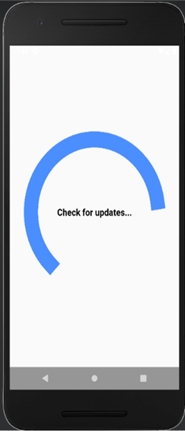

# **Hoi Examination at the Temple of Literature**

&ensp;&thinsp;&ensp;&thinsp;Temple of Literature Quoc Tu Giam has always been one of the famous cultural sites of Vietnam attracting a large number of domestic and foreign tourists. Experiencing the flow of time, its artifacts and scenery have not been intact. The previous projects attempted to recreate important historical events of the Temple of Literature in the past. These efforts are remarkable because they contribute to depicting a part of things that have been gradually lost over the years of history.  
 &ensp;&thinsp;&ensp;&thinsp;However, most of these projects just stop at depicting things and scenes in the form of 3D models. This is a big shortcoming because it cannot reproduce the atmosphere of the old scenes. As a tourist exploring the Temple of Literature, we realized that we wanted to know more than just 3D models. This is why this project was born, we want to recreate the old exam scene at the Temple of Literature through AR technology.

## What this project does?
This project is the backend of the project that recreates the Hoi Examination scene at the Temple of Literature:
1. Provides APIs for uploading and downloading 3D models to be used in web and app environments.
2. Provide APIs that allow synchronous updating of changes of the exam school on the web to the app
3. Provides an interface to upload 3D models
   
4. Provides an interface to view 3D models uploaded
   
5. Provide the interface to design the exam scene displayed on the app
   

## Some pictures of the examination scene are shown on the app
1. Updating UI  
   
2. The scene of the examination school is displayed after scanning the QR code
   
   
   

## Technologies used
### 1. Three.js
> We use the Three.js library to render glb-encoded 3D models on the web. The models used in the project are compressed with draco. It is an open-source library for compressing and decompressing 3D geometric meshes and point clouds. In this way, the models will be optimized for speed and performance in storage and download
### 2. MongoDB
> We use a MongoDB database for storing uploaded 3D models. The idea is to split the models into chunks to store in the database. This way we can store models of arbitrarily large sizes and speed up processing when they need to be downloaded.
### 3.ExpressJS
> A library for designing backend APIs. We use this library to provide the apis and web interfaces outlined above
### 4. EJS
> EJS is a simple templating language that lets you generate HTML markup with plain JavaScript. We use it to design the web UI mentioned above for the project

**You can see more information by**
[Slides.pdf](./preview-images/Slides.pdf)
